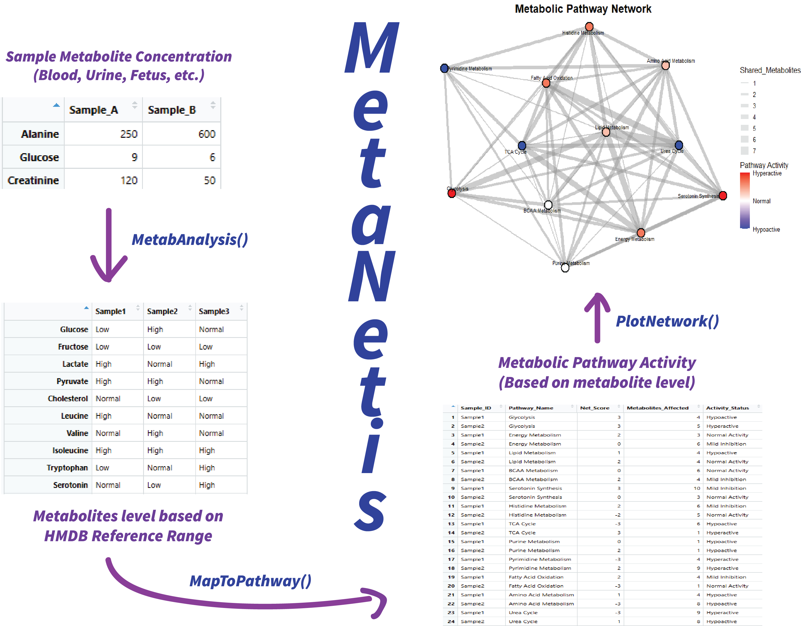

<!-- README.md is generated from README.Rmd. Please edit that file -->

```{r, include = FALSE}
knitr::opts_chunk$set(
  collapse = TRUE,
  comment = "#>",
  fig.path = "man/figures/README-",
  out.width = "100%"
)
```

# MetaNetis

## Description

$\text{MetaNetis}$ is an \R package purpose-built to standardize the critical step of biological interpretation in quantitative metabolomics studies. It takes raw metabolite concentration data and the associated biological context (age and biospecimen type) and benchmarks it against a robust, internally-curated baseline derived from the $\text{Human Metabolome Database (HMDB)}$. The core biological data being analyzed are metabolite concentration values (e.g., \code{umol/L} or \code{ng/mL}) and their functional associations with metabolic pathways. MetaNetis significantly improves the current workflow in computational biology by providing $\text{novel, quantitative functional interpretation}$. $\text{Unlike tools such as MetaboAnalyst, which typically rely on pathway enrichment statistics}$, MetaNetis compares results against $\text{real-world, sample-matched metabolite reference data}$ and directly links individual concentration deviations to pathway activity (Hypoactive/Hyperactive). This unique approach eliminates the interpretation bias inherent in generic comparisons and allows for the precise, quantitative assessment of functional metabolic changes. Development for $\text{MetaNetis}$ was conducted on \R version 4.5.1 (2025-06-13 ucrt) using Windows 10 x64 (build 19045).
```

## Installation

You can install the development version of MetaNetis from [GitHub](https://github.com/dujay971226/MetaNetis) with:

```{r}
install.packages("devtools")
library("devtools")
devtools::install_github("dujay971226/MetaNetis", build_vignettes = TRUE)
library("MetaNetis")
```

## 🎯 Overview
MetaNetis is an $\text{R}$ package designed to bridge the gap between raw metabolomics data and deep biological interpretation. It provides a standardized framework for benchmarking user-supplied metabolite concentrations against a robust, healthy human reference population derived from resources like the Human Metabolome Database ($\text{HMDB}$).

The package's core value lies in its ability to generate high-confidence classifications and translate those classifications into functional insights about metabolic pathway activity.

Critically, MetaNetis offers robust functionality to evaluate quantitative, clinical sampled data such as blood and urine. This capability is a key differentiator from existing tools; for instance, popular platforms like MetaboAnalyst are often restricted to qualitative analysis, relying solely on pathway enrichment. MetaNetis moves beyond simple enrichment to provide a direct, directional assessment of metabolic activity (e.g., hyper- or hypo-regulation), making it a powerful tool for metabolomic and clinical research.



### ✨ Features

\itemize{
  \item $\text{Standardized Concentration Analysis (\code{MetabAnalysis}):}$
    \itemize{
      \item $\text{Benchmarking:}$ Compares input concentrations to a cleaned, aggregated HMDB baseline.
      \item $\text{High-Precision Filtering:}$ Applies **sample-specific filters** for both \code{age} (in years) and
        **biospecimen type** (e.g., \code{Urine}, \code{Plasma}, \code{CSF}).
      \item $\text{Classification:}$ Classifies each metabolite concentration as \code{"Low"}, \code{"Normal"}, or 
        \code{"High"}.
    }
  
  \item $\text{Functional Pathway Mapping (\code{MapToPathway}):}$
    \itemize{
      \item $\text{Dependency:}$ Used an external pathway map from HMDB for linking metabolites to 
        pathways.
      \item $\text{Scoring:}$ Calculates a **Net Score** for each pathway based on the sum of activated (+1) and 
        inhibited (-1) metabolites.
      \item $\text{Activity Level:}$ Determines the overall pathway activity as \code{"Hypoactive"}, \code{"Normal 
        Activity"}, or \code{"Hyperactive"}.
    }

  \item $\text{Flexible Data Management:}$
    \itemize{
      \item Uses a default, curated HMDB reference baseline via \code{GetRefRanges()}.
      \item Allows researchers to easily override the default data with custom reference ranges using 
        \code{SetAltBaseline()}.
    }
}

```{r}
ls("package:MetaNetis")
data(package = "MetaNetis") 
browseVignettes("MetaNetis")
```

## Contribution

Author and Core Package ContributionsThe package MetaNetis was conceived and primarily developed by $\text{Jay Du}$. Jay's core contributions include designing the novel quantitative scoring framework that moves beyond traditional enrichment analysis, developing the robust data processing pipeline for standardizing the Human Metabolome Database ($\text{HMDB}$) reference ranges, and implementing the functional pathway scoring logic (MapToPathway and MetabAnalysis). Significant effort was dedicated to creating a modular and testable package structure, ensuring that core data retrieval functions (GetPathwayMap, GetRefRanges) and visualization tools (PlotNetwork) are seamlessly integrated.

\itemize {
  \item GetPathwayMap: Relies on $\text{HMDB}$ data for metabolite-to-pathway associations.
  \item GetRefRanges: Built upon extensively processed $\text{HMDB}$ Reference Data XML content.
  \item MapToPathway: Uses dplyr and tibble for efficient joining, grouping, and quantitative score aggregation from raw data.
  \item MetabAnalysis: Relies on dplyr and stringr to manage and process metabolite concentration data against the standardized $\text{HMDB}$ baseline, determining the directional status.
  \item PlotNetwork: Depends on igraph for creating the bipartite network projection and ggraph (built on ggplot2) for generating the high-quality, color-coded visualization.
  \item SetAltBaseline: Primarily uses dplyr to manage and update the internal data frame structures for alternative baselines.
}

Generative AI Tool ContributionsThe generative AI tool, Gemini, served as a key collaborative partner throughout the development of MetaNetis. Its assistance was instrumental in ensuring code stability and clarity across the package. Specifically, Gemini was utilized to generate clear, comprehensive commenting and documentation for all core functions within the package. Furthermore, the AI tool provided essential debugging support for both the \code{MapToPathway} and \code{MetabAnalysis} functions, helping to resolve complex issues related to quantitative score aggregation and data matching across disparate input structures, ensuring the reliability of the core analytical pipeline.

## Reference

Csardi, G., & Nepusz, T. (2006). The igraph software package for complex network research. InterJournal, Complex Systems, 1695.

Google. (2025). Gemini.

Grolemund, G. (2015). Learn Shiny - Video Tutorials. \href{https://shiny.rstudio.com/tutorial/}{Link}

Müller, K., & Wickham, H. (2023). tibble: Simple data frames (Version 3.2.1). https://tibble.tidyverse.org/

Pedersen, T. L. (2022). ggraph: An implementation of grammar of graphics for graphs (Version 2.1.0). https://ggraph.data-imaginist.com

R Core Team. (2024). R: A language and environment for statistical computing. R Foundation for Statistical Computing. https://www.R-project.org/

Wickham, H. (2016). ggplot2: Elegant graphics for data analysis. Springer-Verlag.

Wickham, H., François, R., Henry, L., & Müller, K. (2023). dplyr: A grammar of data manipulation (Version 1.1.3). https://dplyr.tidyverse.org/

Wickham, H., & Hester, J. (2024). stringr: Simple, consistent string routines (Version 1.5.1) [R package]. https://stringr.tidyverse.org/

Wickham, H., & Ruiz, M. (2023). tidyr: Tidy messy data (Version 1.3.0). https://tidyr.tidyverse.org/

Wishart, D. S., et al. (2022). HMDB 5.0: The Human Metabolome Database for 2022. Nucleic Acids Research, 50(D1), D218–D227. https://hmdb.ca/


## Acknowledgements

This package was developed as part of an assessment for 2025 BCB410H: Applied Bioinformatics course at the University of Toronto, Toronto, CANADA. MetaNetis welcomes issues, enhancement requests, and other contributions. To submit an issue, use the GitHub issues.
